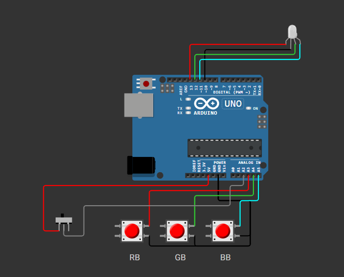

# Changing Colors

This project demonstrates how to control an RGB LED using an Arduino and push buttons. The RGB LED's color can be adjusted by pressing the buttons, allowing you to mix red, green, and blue light to create various colors.

## Features
- Adjust the intensity of red, green, and blue channels using individual buttons.
- A fourth button toggles between increasing and decreasing the intensity.
- Real-time feedback of RGB values is printed to the Serial Monitor.

## Components
- Arduino Uno
- RGB LED
- 3 Push Buttons (RB, GB, BB)
- 1 Toggle Button (PNB)
- Resistors
- Jumper wires
- Breadboard

## Circuit Diagram

## How It Works
1. **Buttons**:
   - RB: Adjusts the red channel.
   - GB: Adjusts the green channel.
   - BB: Adjusts the blue channel.
   - PNB: Toggles between increasing and decreasing the intensity. (+ve/-ve Button)
2. **RGB LED**:
   - The RGB LED is connected to PWM pins on the Arduino, allowing for smooth dimming.
3. **Serial Monitor**:
   - The current RGB values are printed to the Serial Monitor in real-time.

## Code Explanation
The Arduino sketch (`changing_colors.ino`) includes:
- `setup()`: Initializes the pins and Serial communication.
- `rgb()`: Updates the RGB LED's color.
- `getcolor()`: Reads button inputs and adjusts the RGB values accordingly.
- `loop()`: Continuously updates the color and prints the values to the Serial Monitor.

## Usage
1. Connect the components as shown in the circuit diagram.
2. Upload the `changing_colors.ino` sketch to your Arduino.
3. Open the Serial Monitor to observe the RGB values.
4. Press the buttons to adjust the LED's color.

## Circuit Diagram
The circuit diagram is located in the `asset/` folder as `circuit.png`.